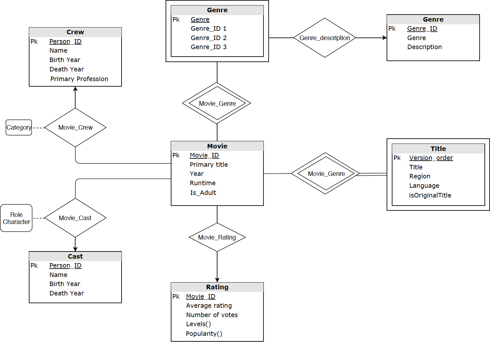
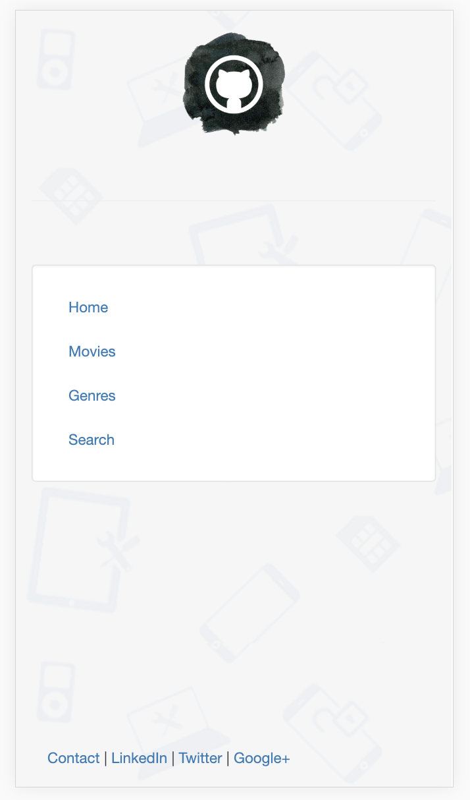

# CS537 Final Project

## Group Members
* Lingsong Zeng, Weimiao Wu, Han You, Zhaolong Yu, Lingyi Tan 

## Introduction
* A lightweight high-performance movie search engine developed by a group of movie lovers.

## Tech Stack
* Database Server: SQLite

* Backend Framework: Python

* Frontend Framework: Django

## Requirements
* Python 2.7/3.5+
* SQLite3
* Django
# 


```bash
$ pip install sqlite3
$ pip install django
$ pip install djangorestframework
$ pip install markdown
$ pip install django-filter
```

## Deployment
**1. Clone the Github repository**
```bash
$ git clone https://github.com/John-YOU/CS437.git
```

**2. Go to the software directory**
```bash
$ cd ./CS437
```

**3. Deploy the local server**
```bash
$ python manage.py runserver
```
**4. Enter the following address in the browser**
```bash
$ localhost:8000
```
## Functions

* Search movies based on titles
* Search movies based on year
* Search movies based on ratings 
* Search movies based on popularity
* Search movies based on the directors
* Search movies based on the genres
* To be continued

## Database Design


## Demo



## Acknowledgement
* Professor Avi Silberschatz
* Jialu Zhang
* Javid Dadashkarimi

